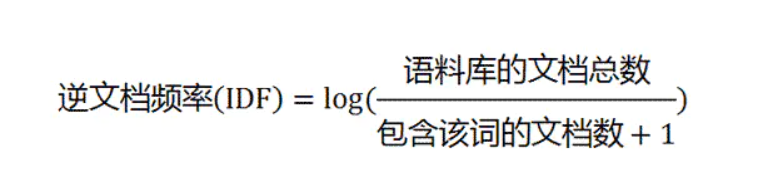
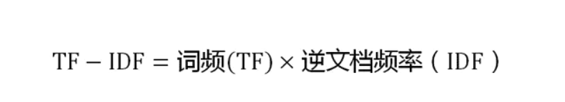

# NLP简介

## NLP基础

### NLP是什么？

自然语言处理（NLP，Natural Language Processing）是研究计算机处理人类语言的一门技术，目的是弥补人类交流（自然语言）和计算机理解（机器语言）之间的差距。<u>NLP包含句法语义分析、信息抽取、文本挖掘、机器翻译、信息检索、问答系统和对话系统等领域</u>。

### [NLP相关知识的构成](https://www.sohu.com/a/277195289_464033)

**分词（segment）**：词是最小的能够独立活动的有意义的语言成分。

**词性标注（part-of-speech tagging）**：基于机器学习的方法里<u>，往往需要对词的词性进行标注</u>。词性一般是指<u>动词、名词、形容词</u>等。标注的目的是表征词的一种隐藏状态，隐藏状态构成的转移就构成了状态转移序列

**命名实体识别（NER，Named Entity Recognition）**：命名实体是指<u>从文本中识别具有特定类别</u>的实体（通常是名词），例如人名、地名、机构名、专有名词等。

**指代消解（anaphora resolution）**：中文中代词出现的频率很高，它的作用的是用来表征前文出现过的人名、地名等。

## NLP常用算法[(1)](https://blog.csdn.net/zhoucheng301/article/details/90736736)

人工智能算法大体上来说可以分类两类：<u>基于统计的机器学习算法(Machine Learning)和深度学习算法(Deep Learning)</u>

### 回归算法

1. LR (Linear Regression，线性回归)
2. SVR (支持向量机回归)
3.  RR (Ridge Regression，岭回归，L2正则化)
4. Lasso Regression，L1正则化

### 分类算法

1. LR (Logistic Regression，逻辑回归又叫逻辑分类)
2. SVM (Support Vector Machine，支持向量机)
3. NB (Naive Bayes，朴素贝叶斯)
4. DT (Decision Tree，决策树)
5. KNN (k-Nearest Neighbors，K近邻算法)

- 1).C4.5
- 2).ID3
- 3).CART

6. 集成算法

- 1).Bagging
- 2).Random Forest (随机森林)
- 3).GB(梯度提升,Gradient boosting)
- 4).GBDT (Gradient Boosting Decision Tree)
- 5).AdaBoost
- 6).Xgboost

7. 最大熵模型

### 聚类算法

1. Kmeans 算法（[优缺点与改进](https://blog.csdn.net/u014465639/article/details/71342072)）
2. 层次聚类
3. 密度聚类
4. 网格聚类
5. 模型聚类 GMM

### 降维算法

1. PCA 主成分分析
2. LDA 线性判别分析

### 概率图模型算法

1. 贝叶斯网络
2. HMM
3. **CRF (条件随机场)**

### 文本挖掘算法

1. 模型

- 1).LDA (主题生成模型，Latent Dirichlet Allocation)
- 2).最大熵模型(其实是个多分类模型，归这里不一定合适)

2. 关键词提取

- 1).tf-idf
- 2).bm25
- 3).textrank
- 4).pagerank
- 5).左右熵 :左右熵高的作为关键词
- 6).[互信息](https://blog.csdn.net/BigData_Mining/article/details/81279612)

3. 词法分析

- 1).分词
  – ①HMM (因马尔科夫)
  – ②CRF (条件随机场)
- 2).词性标注
- 3).命名实体识别

4. 句法分析

- 1).句法结构分析
- 2).依存句法分析

5. 文本向量化

- 1).tf-idf
- 2).word2vec
- 3).doc2vec
- 4).[cw2vec](https://www.jianshu.com/p/f258d0c5c317)

6. 距离计算

- 1).欧氏距离
- 2).相似度计算

### 深度学习算法

(1).BP
(2).CNN
(3).DNN
(3).RNN、LSTM、GRU
(4).Seq2Seq
(5).[Attention、Transformer、BERT

## 建模方面

### 模型优化·

- (1).特征选择
- (2).梯度下降
  [SGD系列](https://blog.csdn.net/u014595019/article/details/52989301)
- (3).交叉验证
- (4).参数调优
- (5).模型评估：准确率、召回率、F1、AUC、ROC、损失函数

### 数据预处理

- (1).标准化
- (2).异常值处理
- (3).二值化
- (4).缺失值填充： 支持均值、中位数、特定值补差、多重插补
- (5).不平衡样本处理（降采样，过采样）

### TF-IDF算法

**停用词**：<u>"的"、"是"、"在"----这一类最常用的词</u>。它们叫做"停用词"（stop words），表示对找到结果毫无帮助、必须过滤掉的词

**TF**："词频"（Term Frequency）：某个词在文章中出现的次数

**IDF**："逆文档频率"（Inverse Document Frequency）：它的大小与一个词的常见程度成反比。如果一个词越常见，那么分母就越大，逆文档频率就越小越接近0。分母之所以要加1，是为了避免分母为0（即所有文档都不包含该词）。

**TF-IDF**

TF-IDF<u>与一个词在文档中的出现次数成正比，与该词在整个语言（语料库）中的出现次数成反比</u>。所以，自动提取关键词的算法就很清楚了，就是计算出文档的每个词的TF-IDF值，然后按降序排列，取排在最前面的几个词。

TF-IDF算法

- **优点**是简单快速，结果比较符合实际情况。
- **缺点**是，单纯以"词频"衡量一个词的重要性，不够全面，有时重要的词可能出现次数并不多。而且，这种算法无法体现词的位置信息，出现位置靠前的词与出现位置靠后的词，都被视为重要性相同，这是不正确的。

### 余弦相似性

有些时候，除了找到关键词，我们还希望找到与原文章相似的其他文章。为了找出相似的文章，需要用到"余弦相似性"（cosine similiarity）

- 第一步，分词。

> 句子A：我/喜欢/看/电视，不/喜欢/看/电影。
>  句子B：我/不/喜欢/看/电视，也/不/喜欢/看/电影。

- 第二步，列出所有的词。

> 我，喜欢，看，电视，电影，不，也。

- 第三步，计算词频。

> 句子A：我 1，喜欢 2，看 2，电视 1，电影 1，不 1，也 0。
>  句子B：我 1，喜欢 2，看 2，电视 1，电影 1，不 2，也 1。

- 第四步，写出词频向量。

> 句子A：[1, 2, 2, 1, 1, 1, 0]
>  句子B：[1, 2, 2, 1, 1, 2, 1]

- 第五步：计算两个向量的相似程度

### Kmeans聚类

**聚类VS分类**

分类：类别是已知的，通过对已知分类的数据进行训练和学习，找到这些不同类的特征，再对未分类的数据进行分类。属于<u>监督学习</u>。

聚类：事先不知道数据会分为几类，通过聚类分析将数据聚合成几个群体。聚类不需要对数据进行训练和学习。属于<u>无监督学习</u>。

**K-means聚类基本概率**

K-Means 聚类算法属于无监督学习方法。K表示类别数，Means表示均值，K一般由人工来指定，或通过层次聚类(Hierarchical Clustering)的方法获得数据的类别数量作为选择K值的参考。选择较大的K可以降低数据的误差，但会增加过拟合的风险。

- 聚类（Clustering）：K-Means 是一种聚类分析（Cluster Analysis）方法。聚类就是将<u>数据对象分组成为多个类或者簇 (Cluster)</u>，使得在<u>同一个簇中的对象之间具有较高的相似度</u>，而<u>不同簇中的对象差别较大</u>。
- 划分（Partitioning）：聚类可以基于划分，也可以基于分层。划分即将对象划分成不同的簇，而分层是将对象分等级。
- 排他（Exclusive）：对于一个数据对象，只能被划分到一个簇中。如果一个数据对象可以被划分到多个簇中，则称为可重叠的（Overlapping）。
- 距离（Distance）：基于距离的聚类是将距离近的相似的对象聚在一起。基于概率分布模型的聚类是在一组对象中，找到能符合特定分布模型的对象的集合，他们不一定是距离最近的或者最相似的，而是能完美的呈现出概率分布模型所描述的模型。

**算法思路如下：**

1. 首先输入 k 的值，即我们指定希望通过聚类得到 k 个分组；
2. 从数据集中随机<u>选取 k 个数据点</u>作为初始质心；
3. 对集合中每一个样本点，<u>计算与每一个初始质心的距离</u>，离哪个初始质心距离近，就属于那个类。
4. 按距离对所有样本分完组之后，<u>计算每个组的均值</u>（最简单的方法就是求样本每个维度的平均值），作为新的质心。
5. 重复（2）（3）（4）直到新的质心和原质心相等，算法结束。

**优点**

- 是解决聚类问题的一种经典算法，简单、快速。
- 对处理大数据集，该算法保持可伸缩性和高效率。
- 当结果簇是密集的，它的效果较好。

**缺点**

- 在簇的平均值可被定义的情况下才能使用，可能不适用于某些应用。
- 必须事先给出k（要生成的簇的数目），而且对初值敏感，对于不同的初始值，可能会导致不同结果。
- 不适合于发现非凸形状的簇或者大小差别很大的簇。
- 对躁声和孤立点数据敏感

### C-value算法

C-value、D-value这两个算法都是用于术语抽取。

C-value方法的基本思想是先用语言规则得到候选术语集，然后使用统计信息来进行过滤。

### D-value算法

D-Value方法是一种基于术语词频分布变化统计
