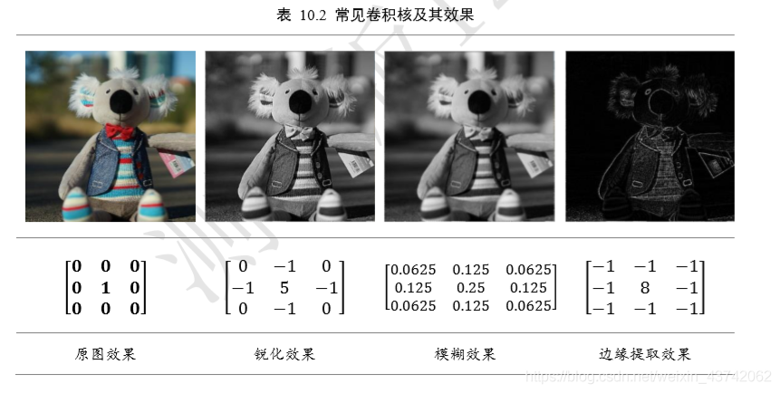
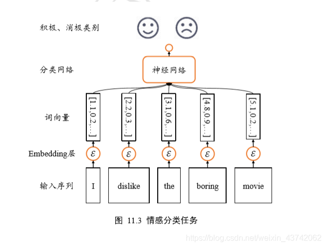
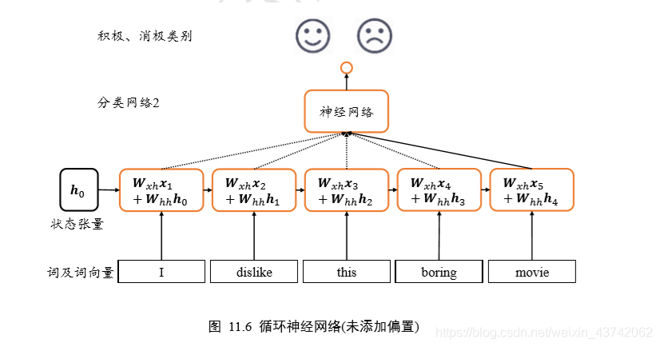
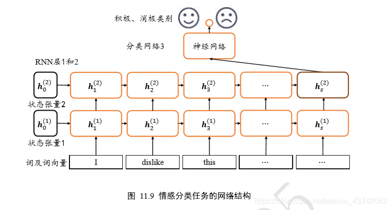
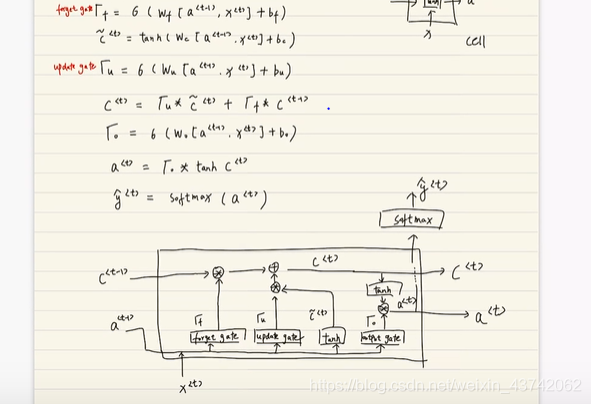
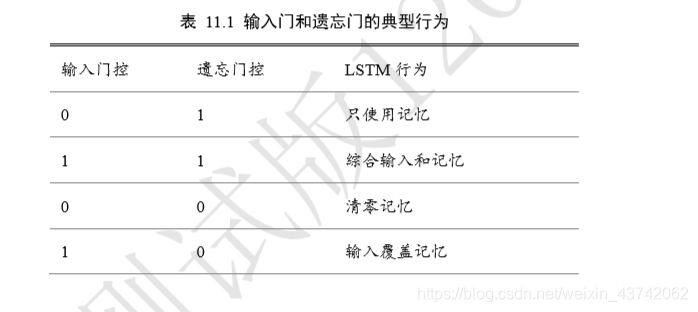

## 卷积神经网络 

- 本质上深度学习和神经网络所指代的是同一类算法。1980 年代，基于生物神经元数学 模型的多层感知机(Multi-Layer Perceptron，简称 MLP )实现的网络模型就被叫作神经网络。
- 可以避免全连接网络的**参数量过大**的缺陷：全连接网络层的每个输出节点都与所有的输入节点相连接，用于提取所有输入节点的 特征信息，这种稠密的连接方式是全连接层参数量大、计算代价高的根本原因。全连接层 也称为稠密连接层(Dense Layer)
- 我们来小结 2D 离散卷积运算流程：每次通过移动卷积核，并与图片对应位置处的感 受野像素相乘累加，得到此位置的输出值。卷积核即是行、列为𝑘大小的权值矩阵𝑾，对 应到特征图上大小为𝑘的窗口即为感受野，感受野与权值矩阵𝑾相乘累加，得到此位置的 输出值。通过权值共享，我们从左上方逐步向右、向下移动卷积核，提取每个位置上的像 素特征，直至最右下方，完成卷积运算。可以看出，两种理解方式殊途同归，从数学角度 理解，卷积神经网络即是完成了 2D 函数的离散卷积运算；从局部相关与权值共享角度理 解，也能得到一样的效果。通过这两种角度，我们既能直观理解卷积神经网络的计算流 程，又能严谨地从数学角度进行推导。正是基于卷积运算，卷积神经网络才能如此命名。 在计算机视觉领域，2D 卷积运算能够提取数据的有用特征，通过特定的卷积核与输入 图片进行卷积运算，获得不同特征的输出图片，如下表 10.2 所示，列举了一些常见的卷积 核及其效果样片。
- 
- 卷积神经网络通过充分利用局部相关性和权值共享的思想，大大地减少了网络的参数 量，从而提高训练效率，更容易实现超大规模的深层网络

### 卷积神经网络 

- 在介绍卷积神经网络时，我们就比较过，卷积神经网络之所以在处理局部相关数据时 优于全连接网络，是因为它充分利用了权值共享的思想，大大减少了网络的参数量，使得 网络训练起来更加高效

- 步长 ：在卷积运算中，如何控制感受野布置的密度呢？对于信息密度较大的输入，如物体数 量很多的图片，为了尽可能的少漏掉有用信息，在网络设计的时候希望能够较密集地布置 感受野窗口；对于信息密度较小的输入，比如全是海洋的图片，可以适量的减少感受野窗 口的数量。感受野密度的控制手段一般是通过移动步长(Strides)实现的。
- 填充 ：。为了让输出𝑶的高宽能够与输入𝑿的相 等，一般通过在原输入𝑿的高和宽维度上面进行填充(Padding)若干无效元素操作，得到增 大的输入𝑿′。通过精心设计填充单元的数量，在𝑿′上面进行卷积运算得到输出𝑶的高宽可 以和原输入𝑿相等，甚至更大。 

### 卷积层实现 

- 在 TensorFlow 中，通过 tf.nn.conv2d 函数可以方便地实现 2D 卷积运算。tf.nn.conv2d 基于输入𝑿:[ b  ℎ 𝑤 𝑐𝑖𝑛] 和卷积核𝑾:[ 𝑘 𝑘 𝑐𝑖𝑛 𝑐𝑜𝑢𝑡] 进行卷积运算，得到输出 𝑶 [b ℎ′ 𝑤′ 𝑐𝑜𝑢𝑡]   ，其中𝑐𝑖𝑛表示输入通道数，𝑐𝑜𝑢𝑡表示卷积核的数量，也是输出特征图的通 道数。

- ```python
  ###########自定义权值 
  x = tf.random.normal([2,5,5,3]) # 模拟输入，3 通道，高宽为 5 # 需要根据 # 
  # [k,k,cin,cout]格式创建 W 张量，4 个 3x3 大小卷积核 
  w = tf.random.normal([3,3,3,4])  
  # 步长为 1, padding 为 0, 
  # 上下左右各填充一个单位，则 padding 参数设置为[[0,0],[1,1],[1,1],[0,0]]
  # 特别地，通过设置参数 padding='SAME'、strides=1 可以直接得到输入、输出同大小的 卷积层，其中 padding 的具体数量由 TensorFlow 自动计算并完成填充操作。
  out = tf.nn.conv2d(x,w,strides=1,padding=[[0,0],[0,0],[0,0],[0,0]]) 
   # 输出张量的 shape 
  TensorShape([2, 3, 3, 4]) 
  # 根据[cout]格式创建偏置向量 
  b = tf.zeros([4]) 
  # 在卷积输出上叠加偏置向量，它会自动 broadcasting 为[b,h',w',cout] 
  out = out +b
  
  ############卷积层类 
  # 通过卷积层类 layers.Conv2D 可以不需要手动定义卷积核𝑾和偏置𝒃张量，直接调用类 实例即可完成卷积层的前向计# 算，实现更加高层和快捷。在 TensorFlow 中，API 的命名有 一定的规律，首字母大写的对象一般表示类，全部小写# 的一般表示函数，如 layers.Conv2D 表示卷积层类，nn.conv2d 表示卷积运算函数。
  
  # 如下创建 4 个3 × 大小的卷积核，竖直方向移 动步长𝑠ℎ = 2，水平方向移动步长𝑠𝑤 = ： 
  layer = layers.Conv2D(4,kernel_size=(3,4),strides=(2,1),padding='SAME') 
  out = layer(x) # 前向计算 
  out.shape # 输出张量的 shape
  
  
  ################实战
  from tensorflow.keras import Sequential
  import tensorflow as tf
  from tensorflow.keras import datasets, layers, optimizers, Sequential, metrics
  network = Sequential([ # 网络容器     
      layers.Conv2D(6,kernel_size=3,strides=1), # 第一个卷积层, 6 个 3x3 卷积核
      layers.MaxPooling2D(pool_size=2,strides=2), # 高宽各减半的池化层     
      layers.ReLU(), # 激活函数     
      layers.Conv2D(16,kernel_size=3,strides=1), # 第二个卷积层, 16 个 3x3 卷积核 
      layers.MaxPooling2D(pool_size=2,strides=2), # 高宽各减半的池化层 
      layers.ReLU(), # 激活函数  
      layers.Flatten(), # 打平层，方便全连接层处理 
      layers.Dense(120, activation='relu'), # 全连接层，120 个节点   
      layers.Dense(84, activation='relu'), # 全连接层，84 节点   
      layers.Dense(10) # 全连接层，10 个节点 
                      ]) 
  # build 一次网络模型，给输入 X 的形状，其中 4 为随意给的 batchsz 
  network.build(input_shape=(4, 28, 28, 1)) 
  # 统计网络信息 
  network.summary()
  
  x=
  # 导入误差计算，优化器模块
  from tensorflow.keras import losses, optimizers
  # 创建损失函数的类，在实际计算时直接调用类实例即可
  criteon = losses.CategoricalCrossentropy(from_logits=True)
  # 训练部分实现如下
      # 构建梯度记录环境
  with tf.GradientTape() as tape:
          # 插入通道维度，=>[b,28,28,1]
          x = tf.expand_dims(x,axis=3)
          # 前向计算，获得 10 类别的概率分布，[b, 784] => [b, 10]
          out = network(x)
          # 真实标签 one-hot 编码，[b] => [b, 10]
          y_onehot = tf.one_hot(y, depth=10)
          # 计算交叉熵损失函数，标量
          loss = criteon(y_onehot, out)
  # 自动计算梯度
  grads = tape.gradient(loss, network.trainable_variables)
  # 自动更新参数
  optimizer.apply_gradients(zip(grads, network.trainable_variables))
  
  
  # 记录预测正确的数量，总样本数量
  correct, total = 0,0
  for x,y in db_test: # 遍历所有训练集样本
          # 插入通道维度，=>[b,28,28,1]
          x = tf.expand_dims(x,axis=3)
          # 前向计算，获得 10 类别的预测分布，[b, 784] => [b, 10]
          out = network(x)
          # 真实的流程时先经过 softmax，再 argmax
          # 但是由于 softmax 不改变元素的大小相对关系，故省去
          pred = tf.argmax(out, axis=-1)
          y = tf.cast(y, tf.int64)
           # 统计预测正确数量
          correct += float(tf.reduce_sum(tf.cast(tf.equal(pred, y),tf.float32)))
          # 统计预测样本总数
          total += x.shape[0]
          # 计算准确率
  print('test acc:', correct/total)
  
  ```

### 池化层 

- 在卷积层中，可以通过调节步长参数𝑠实现特征图的高宽成倍缩小，从而降低了网络的 参数量。实际上，除了通过设置步长，还有一种专门的网络层可以实现尺寸缩减功能，它 就是这里要介绍的池化层(Pooling Layer)。 特别地，最大池化层(Max Pooling)从局部相关元素集中选取最 大的一个元素值，平均池化层(Average Pooling)从局部相关元素集中计算平均值并返。

### BatchNorm层

### 实战

## 循环神经网络

- 序列表示方法

  - Embedding 层 ：在神经网络中，单词的表示向量可以直接通过训练的方式得到，我们把单词的表示层 叫作 Embedding 层。

  - 在 TensorFlow 中，可以通过 layers.Embedding(𝑁vocab,𝑛)来定义一个 Word Embedding 层，其中𝑁vocab参数指定词汇数量，𝑛指定单词向量的长度。例如： 

  - ```python
    x = tf.range(10) # 生成 10 个单词的数字编码
    x = tf.random.shuffle(x) # 打散
    # 创建共 10 个单词，每个单词用长度为 4 的向量表示的层 
    net = layers.Embedding(10, 4) 
    out = net(x) # 获取词向量 
    ```

  - 预训练的词向量 : 目前应用的比较广泛的预训练模型有 Word2Vec 和 GloVe 等。它们已经在海量语料库 训练得到了较好的词向量表示方法，并可以直接导出学习到的词向量表，方便迁移到其它 任务。比如 GloVe 模型 GloVe.6B.50d，词汇量为 40 万，每个单词使用长度为 50 的向量表 示，用户只需要下载对应的模型文件即可，“glove6b50dtxt.zip”模型文件约 69MB。

  - ```python
    # 那么如何使用这些预训练的词向量模型来帮助提升 NLP 任务的性能？非常简单，对于 
    # Embedding 层，不再采用随机初始化的方式，而是利用我们已经预训练好的模型参数去初 # 始化 Embedding 层的查询表。例如： 
    # 从预训练模型中加载词向量表 
    embed_glove = load_embed('glove.6B.50d.txt') 
    # 直接利用预训练的词向量表初始化 Embedding 层 
    net.set_weights([embed_glove]) 
    ```

- 循环神经网络 

  - 现在我们来考虑如何处理序列信号，以文本序列为例，考虑一个句子： “I hate this boring movie” 通过 Embedding 层，可以将它转换为 shape 为[𝑏,𝑠,𝑛]的张量，𝑏为句子数量，𝑠为句子长 度，𝑛为词向量长度。上述句子可以表示为 shape 为[1,5,10]的张量，其中 5 代表句子单词 长度，10 表示词向量长度。
  - 
  - 如何赋予网络提取整体语义特征的能力呢？或者说，如何让网络能够按序提取词向量 的语义信息，并累积成整个句子的全局语义信息呢？我们想到了**内存(Memory)机制**。如果 网络能够提供一个单独的内存变量，每次提取词向量的特征并刷新内存变量，直至最后一 个输入完成，此时的内存变量即存储了所有序列的语义特征，并且由于输入序列之间的先 后顺序，使得内存变量内容与序列顺序紧密关联。
  - 

-  RNN 层使用方法 

  - SimpleRNNCell:  在 TensorFlow 中，可以通过 layers.SimpleRNNCell 来完成𝜎(𝑾  𝒙𝑡 + 𝑾   𝑡−1 +𝒃)计 算。需要注意的是，在 TensorFlow 中，RNN 表示通用意义上的循环神经网络，对于我们 目前介绍的基础循环神经网络，它一般叫做 SimpleRNN。SimpleRNN 与 SimpleRNNCell 的 区别在于，带 Cell 的层仅仅是完成了一个时间戳的前向运算，不带 Cell 的层一般是基于 Cell 层实现的，它在内部已经完成了多个时间戳的循环运算，因此使用起来更为方便快 捷。

  - ```python
    cell = layers.SimpleRNNCell(3) # 创建 RNN Cell，内存向量长度为 3
    cell.build(input_shape=(None,4)) # 输出特征长度 n=4 
    cell.trainable_variables # 打印 wxh, whh, b 张量 
    # 初始化状态向量，用列表包裹，统一格式 
    h0 = [tf.zeros([4, 64])] 
    x = tf.random.normal([4, 80, 100]) # 生成输入张量，4 个 80 单词的句子 
    xt = x[:,0,:] # 所有句子的第 1 个单词 # 构建输入特征 n=100,序列长度 s=80,状态长度=64 的 Cell 
    cell = layers.SimpleRNNCell(64) 
    out, h1 = cell(xt, h0) # 前向计算 
    print(out.shape, h1[0].shape) 
    print(id(out), id(h1[0])) 
    ```

  - 多层 SimpleRNNCell 网络 :和卷积神经网络动辄几十、上百的深度层数来比，循环神经网络很 容易出现梯度弥散和梯度爆炸到现象，深层的循环神经网络训练起来非常困难，目前常见 的循环神经网络模型层数一般控制在十层以内。

  - ```python
    # 以两层的循环神经网络为例
    x = tf.random.normal([4,80,100]) 
    xt = x[:,0,:] # 取第一个时间戳的输入 x0 
    # 构建 2 个 Cell,先 cell0,后 cell1，内存状态向量长度都为 64 
    cell0 = layers.SimpleRNNCell(64) 
    cell1 = layers.SimpleRNNCell(64) 
    h0 = [tf.zeros([4,64])] # cell0 的初始状态向量 
    h1 = [tf.zeros([4,64])] # cell1 的初始状态向量 
    for xt in tf.unstack(x, axis=1): 
        # xt 作为输入，输出为 out0    
        out0, h0 = cell0(xt, h0) 
        # 上一个 cell 的输出 out0 作为本 cell 的输入 
        out1, h1 = cell1(out0, h1) 
    # 保存上一层的所有时间戳上面的输出 
    middle_sequences = [] 
    # 计算第一层的所有时间戳上的输出，并保存 
    for xt in tf.unstack(x, axis=1):     
        out0, h0 = cell0(xt, h0)     
        middle_sequences.append(out0) 
    # 计算第二层的所有时间戳上的输出 # 如果不是末层，需要保存所有时间戳上面的输出 
    for xt in middle_sequences:     
    	out1, h1 = cell1(xt, h1) 
        
    # 需要注意的是，循环神经网络的每一层、每一个时间戳上面均有状态输出，那么对于 后续任务来说，我们应该收集# 哪些状态输出最有效呢？一般来说，最末层 Cell 的状态有可 能保存了高层的全局语义特征，因此一般使用最末# # 层的输出作为后续任务网络的输入。更 特别地，每层最后一个时间戳上的状态输出包含了整个序列的全局信息，如# 果只希望选用 一个状态变量来完成后续任务，比如情感分类问题，一般选用最末层、最末时间戳的状态 输出最为# # 合适。
    ```

  - SimpleRNN 层 ：通过 SimpleRNNCell 层的使用，我们可以非常深入地理解循环神经网络前向运算的每 个细节，但是在实际使用中，为了简便，不希望手动参与循环神经网络内部的计算过程，比如每一层的 状态向量的初始化，以及每一层在时间轴上展开的运算。通过 SimpleRNN 层高层接口可以非常方便地帮助我们实现此目的。 

  - ```python
    layer = layers.SimpleRNN(64) # 创建状态向量长度为 64 的 SimpleRNN 层 
    x = tf.random.normal([4, 80, 100]) 
    out = layer(x) # 和普通卷积网络一样，一行代码即可获得输出 
    out.shape
    
    # 创建 RNN 层时，设置返回所有时间戳上的输出,如果希望返回所有时间戳上的输出列表，可以设置 return_sequences=True 参数
    layer = layers.SimpleRNN(64,return_sequences=True) 
    out = layer(x) # 前向计算
    
    
    #############对于多层循环神经网络，我们可以通过堆叠多个 SimpleRNN 实现
    net = keras.Sequential([ # 构建 2 层 RNN 网络 
        # 除最末层外，都需要返回所有时间戳的输出，用作下一层的输入 
        layers.SimpleRNN(64, return_sequences=True),
        layers.SimpleRNN(64),
    ]) 
    out = net(x) # 前向计算 
    ```

- ### RNN 情感分类问题实战 

  - 现在利用基础的 RNN 网络来挑战情感分类问题。网络结构如图 11.9 所示，RNN 网络 共两层，循环提取序列信号的语义特征，利用第 2 层 RNN 层的最后时间戳的状态向量 h 𝑠 (2) 作为句子的全局语义特征表示，送入全连接层构成的分类网络 3，得到样本𝒙为积极情感的概率P(𝒙为积极情感|𝒙) ∈ [0,1]。

  - 

- #### 梯度弥散和梯度爆炸 

  - 梯度裁剪 : 梯度爆炸可以通过梯度裁剪(Gradient Clipping)的方式在一定程度上的解决。梯度裁剪与张量限幅非常类似，也是通过将梯度张量的数值或者范数限制在某个较小的区间内，从 而将远大于 1 的梯度值减少，避免出现梯度爆炸。

    - ```python
      # 直接对张量的数值进行限幅，
      a=tf.random.uniform([2,2]) 
      tf.clip_by_value(a,0.4,0.6) # 梯度值裁剪 
      
      # 通过限制梯度张量𝑾的范数来实现梯度裁剪
      a=tf.random.uniform([2,2]) * 5 
      # 按范数方式裁剪 
      b = tf.clip_by_norm(a,5)
      
      #全局范数裁剪: 在 TensorFlow 中， 可以通过 tf.clip_by_global_norm 函数快捷地缩放整体网络梯度𝑾的范数。
      w1=tf.random.normal([3,3]) # 创建梯度张量 1 w2=tf.random.normal([3,3])
      # 创建梯度张量 2 
      # 计算 global norm 
      global_norm=tf.math.sqrt(tf.norm(w1)**2+tf.norm(w2)**2)  
      # 根据 global norm 和 max norm=2 裁剪 
      (ww1,ww2),global_norm=tf.clip_by_global_norm([w1,w2],2) 
      # 计算裁剪后的张量组的 
      global norm global_norm2 = tf.math.sqrt(tf.norm(ww1)**2+tf.norm(ww2)**2) 
      # 打印裁剪前的全局范数和裁剪后的全局范数 
      print(global_norm, global_norm2) 
      ```

  - 梯度弥散 :对于梯度弥散现象，可以通过增大学习率、减少网络深度、添加 Skip Connection 等一 系列的措施抑制。 增大学习率𝜂可以在一定程度防止梯度弥散现象。

- ### LSTM

  - 
  - 循环神经网络除了训练困难，还有一个更严重的问题，那就是短时记忆(Short-term memory)。 LSTM 相对于基础的 RNN 网络来 说，记忆能力更强，更擅长处理较长的序列信号数据，LSTM 提出后，被广泛应用在序列 预测、自然语言处理等任务中，几乎取代了基础的 RNN 模型。
  - 基础的 RNN 网络结构如图 11.13 所示，上一个时间戳的状态向量 𝑡−1与当前时间戳的 输入𝒙𝑡经过线性变换后，通过激活函数𝑡𝑎𝑛ℎ后得到新的状态向量 𝑡。相对于基础的 RNN网络只有一个状态向量 𝑡，LSTM 新增了一个状态向量𝑪𝑡，同时引入了门控(Gate)机制，通 过门控单元来控制信息的遗忘和刷新，如图 11.14 所示。  
  - 
  - 遗忘门: 遗忘门作用于 LSTM 状态向量𝒄上面，用于控制上一个时间戳的记忆𝒄𝑡−1对当前时间戳 的影响。𝜎为激活函数，一般使用 Sigmoid 函数。当门控𝒈𝑓 = 1时，遗忘门全部打开，LSTM 接受上 一个状态𝒄𝑡−1的所有信息；当门控𝒈𝑓 = 0时，遗忘门关闭，LSTM 直接忽略𝒄𝑡−1，输出为 0 的向量。
  - 输入门 : 输入门用于控制 LSTM 对输入的接收程度
  - 输出门 .
  - 
  - 

- ### LSTM层使用方法

  -  LSTMCell : LSTMCell 的用法和 SimpleRNNCell 基本一致，区别在于 LSTM 的状态变量 List 有两 个，即[ 𝑡,𝒄𝑡]，需要分别初始化，其中 List 第一个元素为 𝑡，第二个元素为𝒄𝑡。调用 cell 完成前向运算时，返回两个元素，第一个元素为 cell 的输出，也就是 𝑡，第二个元素为 cell 的更新后的状态 List：[ 𝑡,𝒄𝑡]。首先新建一个状态向量长度ℎ = 64的 LSTM Cell，其中 状态向量𝒄𝑡和输出向量 𝑡的长度都为ℎ

  - ```python
    x = tf.random.normal([2,80,100]) 
    xt = x[:,0,:] # 得到一个时间戳的输入
    cell = layers.LSTMCell(64) # 创建 LSTM Cell 
    # 初始化状态和输出 List,[h,c] 
    state = [tf.zeros([2,64]),tf.zeros([2,64])] 
    out, state = cell(xt, state) # 前向计算 
    # 在序列长度维度上解开，循环送入 LSTM Cell 单元 
    for xt in tf.unstack(x, axis=1):  
        # 前向计算 
        out, state = cell(xt, state) 
    
    ```

  - LSTM 层 

  - ```python
    # 创建一层 LSTM 层，内存向量长度为 64 
    layer = layers.LSTM(64) 
    # 序列通过 LSTM 层，默认返回最后一个时间戳的输出 h 
    out = layer(x) 
    # 经过 LSTM 层前向传播后，默认只会返回最后一个时间戳的输出，如果需要返回每个时间 戳上面的输出，需要设 # 置 return_sequences=True 标志.
    # 创建 LSTM 层时，设置返回每个时间戳上的输出 
    layer = layers.LSTM(64, return_sequences=True) 
    # 前向计算，每个时间戳上的输出自动进行了 concat，拼成一个张量 
    out = layer(x)
    
    ########### 和 CNN 网络一样，LSTM 也可以简单地层层堆叠 
    net = keras.Sequential([ 
        layers.LSTM(64, return_sequences=True), # 非末层需要返回所有时间戳输出 
        layers.LSTM(64) 
    ]) 
    # 一次通过网络模型，即可得到最末层、最后一个时间戳的输出 
    out = net(x) 
    ```

- ### GRU 简介

  - 

  - LSTM 具有更长的记忆能力，在大部分序列任务上面都取得了比基础的 RNN 模型更好 的性能表现，更重要的是，LSTM 不容易出现梯度弥散现象。但是 LSTM 结构相对较复 杂，计算代价较高，模型参数量较大。

  - 。GRU 把内部状态向量和输出向量合并，统一为状态向量 ，门控数量也减少到 2 个：复位门 (Reset Gate)和更新门(Update Gate)。

  - GRU 使用方法 ：
  
  - ```python
    # 初始化状态向量，GRU 只有一个
    h = [tf.zeros([2,64])] 
    cell = layers.GRUCell(64) # 新建 GRU Cell，向量长度为 64 
    # 在时间戳维度上解开，循环通过 cell 
    for xt in tf.unstack(x, axis=1):     
        out, h = cell(xt, h) 
    # 输出形状 
    out.shape 
    
    
    #####通过 layers.GRU 类可以方便创建一层 GRU 网络层，通过 Sequential 容器可以堆叠多 层 GRU 层的网络。
    net = keras.Sequential([ 
        layers.GRU(64, return_sequences=True), 
        layers.GRU(64) 
    ]) 
    out = net(x) 
    ```
  
  


