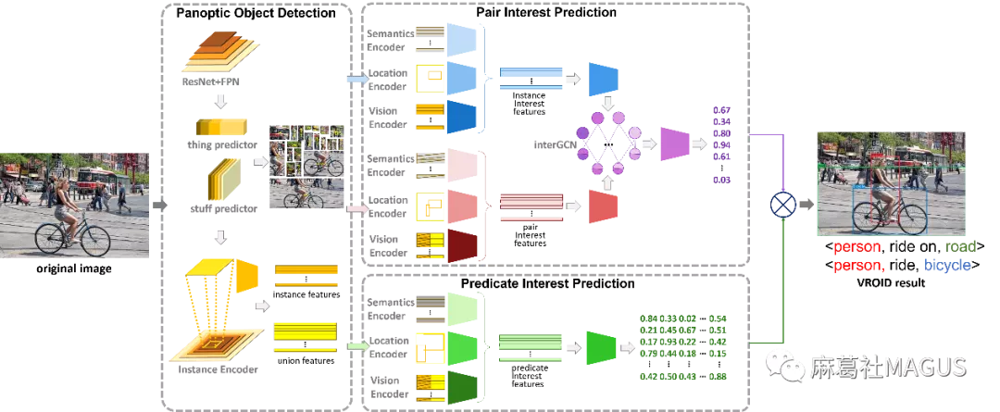
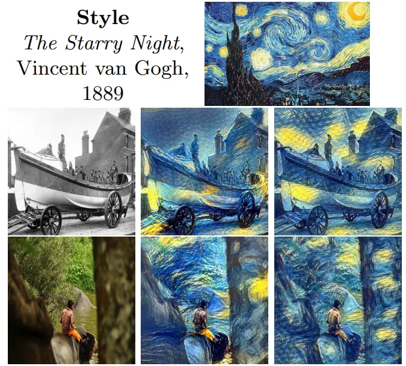

# 媒体识别和理解

### 多模态融合

- **多模态融合 （Multimodal Fusion）**[CSDN分享](https://blog.csdn.net/qq_39388410/article/details/105145074)

一般来说，模态是指**事物**发生或**存在的方式**，**多模态**是指两个或者两个以上的**模态的各种形式的组合**。对每一种信息的来源或者形式，都可以称为一种模态（Modality），**目前研究领域中主要是对图像，文本，语音三种模态的处理**。之所以要对模态进行融合，是因为不同模态的表现方式不一样，看待事物的角度也会不一样，所以**存在一些交叉（所以存在信息冗余），互补（所以比单特征更优秀）的现象**，甚至模态间可能还存在多种不同的信息交互，如果能合理的处理多模态信息，就能**得到丰富特征信息**。即概括来说多模态的显著特点是： **冗余性 和 互补性** 。

传统特征融合算法主要可以分为三类：<u>1.基于贝叶斯决策理论的算法 2.基于稀疏表示理论的算法 3.基于深度学习理论算法</u>。传统方法不做整理，其中的

深度学习方法按照融合的层次从下到上每一层都可以fusion：

1. pixel level。对原始数据最小粒度进行融合。
2. feature level 。对抽象的特征进行融合，这也是用的最多的。包括early 和 late fusion，代表融合发生在特征抽取的早期和晚期，如上图。early是指先将特征融合后（concat、add）再输出模型，缺点是无法充分利用多个模态数据间的互补性，且存在信息冗余问题（可由PCA，AE等方法缓解）。late分融合和不融合两种形式，不融合有点像集成学习，不同模态各自得到的结果了之后再统一打分进行融合，好处是模型独立鲁棒性强。融合的方式即在特征生成过程中（如多层神经网络的中间）进行自由的融合，灵活性比较高，如金字塔融合。
3. decision level 对决策结果进行融合，这就和集成学习很像了。
4. hybrid。混合融合多种融合方法。

​																				图2 本文方法流程图

### [兴趣关系检测](https://mp.weixin.qq.com/s?__biz=MzIyNjc0NDI2Ng==&mid=2247484137&idx=1&sn=f2c305d5ac7526e7c64d7055418f66de&chksm=e86a804cdf1d095af17f512d336e6b8c1d95daae25c68bfa8a130af21a625b81d008232a36a7&mpshare=1&scene=23&srcid=0525v7m1UOjui2FZ23NsbPY2&sharer_sharetime=1621943859086&sharer_shareid=23b040abd414e55dda4ba335f5bd4a74#rd)

-  **摘要** 

继去年在MM 2019上提出兴趣物体检测之后，本文进一步提出了一个兴趣视觉关系检测(Visual Relation of Interest Detection, VROID)的新任务，**旨在检测能够表达图像主要内容的视觉关系**。兴趣视觉关系相较于兴趣物体，对表达图像主旨能够提供更详细、准确的信息。

传统的视觉关系检测(Visual Relation Detection, VRD)致力于检测出图片中所有的视觉关系。但是，一张图片中包含的视觉关系可能只有一小部分对表达图片的主旨有用，文中将其命名为兴趣视觉关系(Visual Relations of Interest, VROIs)。本文构建了一个针对兴趣视觉关系检测的新数据集ViROI，同时提出了一个“物体——物体对——关系三元组”的兴趣传递网络(Interest Propagation Network, IPNet)，与传统的视觉关系检测方法、场景图生成方法和从图片说明中抽取兴趣视觉关系的方法相比，取得了较好的结果。

-  **主要贡献** 

  - 提出兴趣视觉关系检测的新任务，旨在检测对表达图像主旨重要的视觉关系；
  - 提出一种新的兴趣传递网络，使兴趣从物体到物体对到关系三元组逐层传递，实现兴趣视觉关系的检测；
  - 构建针对兴趣视觉关系检测的新数据集，包含30,120张图片。

- **方法流程** 

  本文提出的**兴趣传递网络IPNet**以图像作为输入，使用**全景物体检测模块**检测物体并得到物体特征，使用物体对兴趣预测模块进行“物体到物体对”的兴趣传递，使用谓语兴趣预测模块预测在物体对是兴趣的情况下谓语的兴趣度，最终将物体对兴趣和谓语兴趣结合，完成“物体对到关系三元组”的兴趣传递，并得到最终的兴趣视觉关系。

  

### [人-物交互检测](https://mp.weixin.qq.com/s/Pfxqrmrmyo_AeUPWd0IBsg)

- **摘要**

​         人-物交互检测（Human-Object Interaction Detection, HOID）是以人为中心的视觉场景理解的关键问题，**旨在检测和识别图像中的人和物体以及他们之间的交互关系**，需要同时具备**视觉感知**和**推理能力**。现有的基于卷积神经网络（Convolutional Neural Network, CNN）的方法大多依赖纯视觉特征，在复杂的人-物关系理解上仍存在不足。

​		摘要为了提高CNN的推理能力，本文提出了一种**多级条件网络（Multi-level Conditioned Network, MLCNet）**，将外部的空间语义先验与视觉特征相融合。具体地，**本文构建了一个多分支CNN作为多层次视觉表示的主干，然后将人体结构、物体类别和位置等外部知识作为条件进行编码，通过仿射变换和注意机制动态影响CNN的特征提取，最后融合多模特征来区分各种交互动作。**本文在HICO-DET和V-COCO这两个最常用的基准上对MLCNet进行评估。实验结果表明，本文方法优于现有的方法。

- **核心**

<u>为了在低层视觉特征与高层语义信息之间建立桥梁，本文提出了MLCNet，利用外部空间语义先验作为条件，动态影响CNN的特征提取。</u>

- **任务**

**输入为源图像**，**输出所有的“人-动词-物体”三元关系组和主语、宾语的包围框**。目的在于定位人、物体并识别人与物体之间的交互

- **评价指标**

- **<u>方法流程</u>**

1. 应用目标检测、姿态估计、人体解析等进行外部知识获取
2. 构造了一个多分支CNN作为MLCNet的主干，从而获得不同尺度的视觉特征。（多层次的视觉表示是HOID的关键，其目的是对粗粒度和细粒度的视觉信息进行编码。）
3. 为进一步提高上述多分支CNN的推理能力，采用**多级条件机制**，利用人体结构和物体上下文的空间语义先验动态影响全局图像特征、交互区域特征和身体部位的特征提取
4. 

#### **入门**

- 视觉识别近年来发展迅速，包括物体检测、分割和动作识别。但是，理解场景不仅需要检测单个物体实例，还需要识别物体对之间的视觉关系，其中尤为重要的一环是检测并识别每个人如何与周围物体交互，即人-物交互（HOI）检测

### [视频风格迁移（video style transfer）](https://mp.weixin.qq.com/s/ee4ZNVuIooSyEevAEK0c_w)

- **摘要**

视频风格迁移任务旨在**将视频渲染为风格图像所指定的风格**，同时**保留原始内容结构**。现有视频风格迁移方法难以同时满足<u>渲染高效性、风格任意性以及时间一致性</u>等要求。本文针对上述要求**提出了一种实时渲染且支持任意风格的视频风格迁移方法，构建了包含预测网络、风格化网络以及损失网络的三网络架构**。其中，**预测网络用于提取风格图像中的风格参数；风格化网络用于生成风格化视频；损失网络计算内容、风格及时间一致性损失，用于训练预测网络与风格化网络。**同时，本文还设计了三个对比实验与一项用户调研，以验证本文方法的有效性。实验结果表明，本文方法取得了优于现有方法的效果。

​																图1 不同方法的视频风格迁移效果对比

- **方法流程** 

本文所提出的三网络架构以风格图像及内容视频帧作为**输入**，通过**预测网络**提取该风格图像的风格参数，通过**风格化网络**获取风格参数并风格化视频帧，从而生成相应的风格化视频，通过**损失网络**计算并最小化内容、风格以及时间一致性的加权损失，从而达到训练预测网络与风格化网络的目的

- **什么是风格迁移**?

风格迁移是使用某些手段, 把图像从原风格转换到另外一个风格, 同时保证图像内容没有变化, 举个栗子, 下面的这类图片应该是很多人见过了

Gatys等人发表的开创性论文**《Neural Style Transfer 》**，展示了深度卷积神经网络的显著特性。从参数卷积层中学习到的顺序表示可以分为**“内容 content”和“风格 style”**。风格迁移背后的基本思想是，在诸如ImageNet分类之类的任务上经过预训练的DCNN可以用作描述网络 descriptor networks。图像通过诸如VGG之类的预训练DCNN传递，并且可以使用中间特征激活来融合一个图像的“风格 style”与另一个图像的“内容 content”。从预训练网络的特征激活中得出损失函数是神经风格迁移（Neural Style Transfer）背后的基本思想。

尽管取得了惊人的结果，但根据实施神经风格迁移（Neural Style Transfer）仍需要缓慢的迭代优化过程。首先，使用生成器网络生成图像。该输出图像通过预先训练的VGG。通过计算Gram矩阵可对来自第1、2、3、4和5层的ReLU激活进行非本地化（non-localized），从而形成风格输出（style output）。第4层中ReLU激活的内积形成内容输出（content output）。然后通过反向传播对图像进行优化，以使风格和内容输出与目标风格和目标内容图像匹配。

[吴恩达的风格迁移](https://www.pianshen.com/article/5811712317/)

视频海报自适应调整

### 视觉关系检测（现状研究）

计算机视觉（Computer Vision，CV）是使用机器来理解和分析图像的过程。近年来，基于深度学习（特别是卷积神经网络）计算机视觉技术的进步，机器理解图像的水平大大提高，视觉技术，如图像分类、定位和分割等技术也取得了显著进步。然而，**为理解一张图像，只对其中的目标进行分类或定位是远远不够的，还需要对于图像中目标与目标之间关系进行识别，即<u>视觉关系检测</u>**。

- **挑战**

视觉关系检测的重点是**目标识别与分类、目标之间关系的配对、以及关联目标的关系预测**。但随着研究的深入，目标检测的准确性问题日益突出。

在判定目标的类别与位置时，预测的些许偏差便可能会导致关系检测失误；

视觉关系理解的类别数远超目标检测任务中的目标类别数，这对视觉关系检测方法的迁移拓展能力提出了要求；

数据集的标注数据不完全，如在多目标图像中，只有小部分目标被标注，或只有部分目标之间的关系被标注，或被标注的目标对只与一个谓词关联[1]；

视觉关系检测与图像目标检测有差异。图像目标检测输出的是所检测目标在图像中的位置与目标的类别，通常不与其他检测目标关联；而**视觉关系检测**是在**图像目标检测**的基础上，**预测物品之间的关联**，**关联关系通常以“主语-谓语-宾语”这样的三元组的形式来表达**。并且**图像通常包含多组三元组**，例如在图1中男孩、自行车、帽子和轮子分别组成三组关系。

- 为了能够具体分析各数据集的表现，会从以下三个角度计算评价指标：
  - 谓词检测：输入为图片及图片中所含目标的位置，输出为预测目标之间有可能的关联。以这种方式验证数据集在不受目标检测性能限制的情况下预测视觉关系的难度。
  - 短语检测：输入为图片，输出为“主语-谓语-宾语”的关系三元组及包含整个关系三元组的边界框，且预期得到的边界框与事实框的重合度高于0.5。
  - 关系检测：输入为图片，输出为“主语-谓语-宾语”的三元组，并且主语和宾语的边界框与真实的标注框重合度高于0.5。
  - 评 价 指 标 包 括 **<u>召回 率（R e c a l l @ K）</u>**和 **<u>平均 精 度（m A P）</u>**。

- <u>***实现视觉关系检测***</u>

首先要**定位并识别出图像中的各类目标**，通过**<u>目标检测模块</u>**（主要是卷积神经网络）提取包括整体图像特征、目标区域图像特征、目标位置信息特征、目标类别语义特征等作为关系检测模块的基础特征信息。**<u>关系检测模块</u>**使用这些特征作为输入，经过视觉和语义特征融合，**输出预测的三元组标签以及位置**。在输出模块通过有针对性的定义模型的损失函数，达到更优的训练效果。

**目标检测模块**：大 多 数 研 究 都 采用**FasterRCNN**[19]作为检测模型。FasterRCNN引入了区域候选网络，检测速度更快，精度更高。

（1） VRD[2]利用了R-CNN[20]目标检测模型的输出得到所有的目标候选框，然后经过视觉模型和语言模型分别得到每一对目标对的关系似然度。

（2）VTransE[12]是一种端到端的模型，其将目标的视觉特征映射到低维的关系空间中，然后使用转移向量来表示目标之间的关系

（3）DR-Net[8]方法将更多的特征纳入模型：目标对区域的视觉特征、目标的空间结构特征（以一种双空间模板的方式将每个目标对的空间结构特征表示为一个64维的向量，而不是简单的几何度量（如候选框的大小、位置等））、统计关系特征（主语、宾语和谓词出现情况的统计概率）。

（4）Zoom-Net[16]中提出了SCM-A模块，将多个SCM-A模块堆叠组成视觉模块主体，对局部的目标特征和全局的谓语关系特征进行深层次的信息传递，实现对主语、谓语、关系视觉特征的深度融合 

- **应用**

视觉关系检测技术已能运用于多种图像理解任务，如**目标检测、图像检索[23]和描述、以及VQA（视觉问答）**[24-25]等。未来，还将有更加广阔的应用前景

1. 图像检索：根据相关的图像输入或自然语言描述输入，图像检索会在图像库中检索出符合条件的图像，图像描述则会对输入图像进行自然语言的描述。
2. 在VQA应用中，所有的问答题目首先都依赖于目标之间关系的存在，如果目标之间没有关联，那问题也不会出现，例如：“树下的人穿着什么颜色的衣服？”这个问题中出现的目标有四个：树，人，衣服和颜色。只有清楚的了解图像中目标间的相互关系，

https://zhuanlan.zhihu.com/p/31426458)

### NMS—非极大值抑制算法

在目标检测中，得到多个候选框及其置信度得分。非极大值抑制算法(NMS)对多个候选框，去除重合率大的冗余候选框，得到最具代表性的结果，以加快目标检测的效率。

 NMS 算法的大致过程：每轮选取置信度最大的 Bounding Box（简称 BBox，有时也会看到用 Pc，Possible Candidates 代替讲解的） ，接着关注所有剩下的 BBox 中与选取的 BBox 有着高重叠（IOU）的，它们将在这一轮被抑制。这一轮选取的 BBox 会被保留输出，且不会在下一轮出现。接着开始下一轮，重复上述过程：选取置信度最大 BBox ，抑制高 IOU BBox。

非极大值抑制算法（non maximum suppression, NMS），这个算法不单单是针对Yolo算法的，而是所有的检测算法中都会用到。NMS算法主要解决的是一个目标被多次检测的问题。流程是：首先从所有的检测框中找到置信度最大的那个框，然后挨个计算其与剩余框的IOU，如果其值大于一定阈值（重合度过高），那么就将该框剔除；然后对剩余的检测框重复上述过程，直到处理完所有的检测框。Yolo预测过程也需要用到NMS算法。

