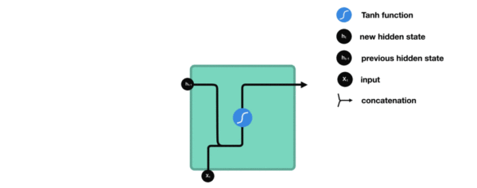

# 常见的神经网络模型

### 什么是RNN模型

- RNN(Recurrent Neural Network), 中文称作循环神经网络, 它一般以序列数据为输入, 通过网络内部的结构设计有效捕捉序列之间的关系特征, 一般也是以序列形式进行输出。

### RNN模型的分类

- 这里我们将从两个角度对RNN模型进行分类. 第一个角度是输入和输出的结构, 第二个角度是RNN的内部构造.

- 按照输入和输出的结构进行分类:
  - N vs N - RNN：: 输入和输出序列是等长的. 由于这个限制的存在, 使其适用范围比较小, 可用于生成等长度的合辙诗句.
  - N vs 1 - RNN：这种结构经常被应用在文本分类问题上.
  - 1 vs N - RNN：这种结构可用于将图片生成文字任务、音乐生成等。
  - N vs M - RNN： 这是一种不限输入输出长度的RNN结构, 它由**编码器和解码器**两部分组成, 两者的内部结构都是某类RNN, 它也被称为**seq2seq架构**. 输入数据首先通过编码器, 最终输出一个隐含变量c, 之后最常用的做法是使用这个隐含变量c作用在解码器进行解码的每一步上, 以保证输入信息被有效利用.

- 按照RNN的内部构造进行分类：传统RNN、LSTM、Bi-LSTM、GRU、Bi-GRU

### 传统RNN

- 我们把目光集中在中间的方块部分, 它的**输入有两部分**, 分别是**h(t-1)**以及x(t), 代表**上一时间步的隐层输出**, 以及**此时间步的输入,** 它们进入RNN结构体后, 会"融合"到一起, 这种融合我们根据结构解释可知, 是将二者进行**拼接**, 形成新的张量[x(t), h(t-1)], 之后这个新的张量将通过一个全连接层(线性层), 该层使用tanh作为激活函数, 最终得到该时间步的输出h(t), 它将作为下一个时间步的输入和x(t+1)一起进入结构体. 以此类推.
- 

- 
- **激活函数tanh的作用:**用于帮助调节流经网络的值, tanh函数将值压缩在-1和1之间.
- **传统RNN的优势:**
  - 由于内部**结构简单**, 对计算资源要求低, 相比之后我们要学习的RNN变体:LSTM和GRU模型参数总量少了很多, 在**短序列任务上**性能和效果都表现优异.

- **传统RNN的缺点:**
  - 传统RNN在解决**长序列之间的关联（效果不好）**时, 通过实践，证明经典RNN表现很差, 原因是在进行反向传播的时候, 过长的序列导致梯度的计算异常, 发生梯度消失或爆炸.
- 什么是梯度消失或爆炸呢？
  - 根据反向传播算法和链式法则, 梯度的计算可以简化为以下公式:

- 其中sigmoid的导数值域是固定的, 在[0, 0.25]之间, 而一旦公式中的w也小于1, 那么通过这样的公式连乘后, 最终的梯度就会变得非常非常小, 这种现象称作梯度消失. 反之, 如果我们人为的增大w的值, 使其大于1, 那么连乘够就可能造成梯度过大, 称作梯度爆炸.

- **梯度消失或爆炸的危害:**
  - 如果在训练过程中发生了**梯度消失，权重无法被更新**，最终导致训练失败; **梯度爆炸**所带来的梯度过大，**大幅度更新网络参数，**在极端情况下，结果会溢出（NaN值）.

### LSTM

- LSTM：（Long Short-Term Memory）也称长短时记忆结构, 它是传统RNN的变体, 与经典RNN相比能够有效捕捉长序列之间的语义关联, **缓解梯度消失或爆炸现象.** 同时LSTM的结构更复杂, 它的核心结构可以分为四个部分去解析：**遗忘门、输入门、细胞状态、输出门**

-  **LSTM的内部结构图**：

  

- 遗忘门部分结构图与计算公式:

- **遗忘门结构：**与传统RNN非常相似**, 首先将当前时间步输入x(t)与上一个时间步隐含状态h(t-1)拼接, 得到[x(t), h(t-1)], 然后通过一个全连接层做变换, 最后通过sigmoid函数进行激活得到f(t), 我们可以**将f(t)看作是门值**, 好比一扇门开合的大小程度, 门值都将作用在通过该扇门的张量, **遗忘门门值将作用的上一层的细胞状态上, 代表遗忘过去的多少信息,** 又因为遗忘门门值是由x(t), h(t-1)计算得来的, 因此整个公式意味着根据当前时间步输入和上一个时间步隐含状态h(t-1)来决定遗忘多少上一层的细胞状态所携带的过往信息.
- **输入门部分结构图与计算公式:**

------

- **输入门结构分析:**我们看到输入门的计算公式有两个, 第一个就是产生**输入门门值it**的公式, 它和遗忘门公式几乎相同, 区别只是在于它们之后要作用的目标上. **这个公式意味着输入信息有多少需要进行过滤**. 输入门的第二个公式是**与传统RNN的内部结构计算相同**. 对于LSTM来讲, 它得到的是**当前的细胞状态**, 而不是像经典RNN一样得到的是隐含状态.

- **细胞状态更新图与计算公式:**

- **细胞状态更新分析:**细胞更新的结构与计算公式非常容易理解, 这里没有全连接层, 只是**将刚刚得到的遗忘门门值与上一个时间步得到的C(t-1)相乘, 再加上输入门门值与当前时间步得到的未更新C(t)相乘的结果**. 最终得到更新后的C(t)作为下一个时间步输入的一部分. 整个细胞状态更新过程就是对遗忘门和输入门的应用.

- **细胞状态更新过程演示:**

- **什么是Bi-LSTM ：**Bi-LSTM即双向LSTM, 它没有改变LSTM本身任何的内部结构, **只是将LSTM应用两次且方向不同,** 再将两次得到的LSTM**结果进行拼接**作为最终输出.

- **Bi-LSTM结构分析:**我们看到图中对"我爱中国"这句话或者叫这个输入序列, 进行了从左到右和从右到左两次LSTM处理, 将得到的结果张量进行了拼接作为最终输出**. 这种结构能够捕捉语言语法中一些特定的前置或后置特征, 增强语义关联,但是模型参数和计算复杂度也随之增加了一倍,** 一般需要对语料和计算资源进行评估后决定是否使用该结构。
- **LSTM优势:**LSTM的门结构能够**有效减缓长序列问题中可能出现的梯度消失或爆炸**, 虽然并不能杜绝这种现象, 但在更长的序列问题上表现优于传统RNN.
- **LSTM缺点:**由于内部结构相对较复杂, 因此训练效率在同等**算力**下较传统RNN低很多。

### GRU

- GRU（Gated Recurrent Unit）也称门控循环单元结构, 它也是传统RNN的变体, 同LSTM一样能够有效捕捉长序列之间的语义关联, **缓解梯度消失或爆炸现象**. 同时它的结构和计算要比**LSTM更简单,** 它的核心结构可以分为两个部分去解析：更新门、重置门

- GRU的内部结构图和计算公式

- **内部结构分析:**
  - 和之前分析过的LSTM中的门控一样, 首先计算**更新门和重置门的门值, 分别是z(t)和r(t)**, **计算方法就是使用X(t)与h(t-1)拼接进行线性变换, 再经过sigmoid激活.** 之后重置门门值作用在了h(t-1)上, 代表控制上一时间步传来的信息有多少可以被利用. 接着就是使用这个重置后的h(t-1)进行基本的RNN计算, 即与x(t)拼接进行线性变化, 经过tanh激活, 得到新的h(t). 最后更新门的门值会作用在新的h(t)，而1-门值会作用在h(t-1)上, 随后将两者的结果相加, 得到最终的隐含状态输出h(t), 这个过程意味着更新门有能力保留之前的结果, 当门值趋于1时, 输出就是新的h(t), 而当门值趋于0时, 输出就是上一时间步的h(t-1).

- Bi-GRU与Bi-LSTM的逻辑相同, 都是不改变其内部结构, 而是将模型应用两次且方向不同, 再将两次得到的LSTM结果进行拼接作为最终输出. 具体参见上小节中的Bi-LSTM.

### 预训练模型
​      BERT是一个预训练的模型，那么什么是预训练呢？举例子进行简单的介绍
​      假设已有A训练集，<u>先用A对网络进行预训练，在A任务上学会网络参数，然后保存以备后用</u>，当来一个新的任<u>务B，采取相同的网络结构，网络参数初始化的时候可以加载A学习好的参数，</u><u>其他的高层参数随机初始化，之后用B任务的训练数据来训练网络</u>，当加载的参数保持不变时，称为"frozen"，当加载的参数随着B任务的训练进行不断的改变，称为“fine-tuning”，即更好地把参数进行调整使得更适合当前的B任务

### Seq2Seq简介

Seq2Seq模型是<u>输入输出长度不确定</u>的模型。seq2seq 是一个<u>Encoder–Decoder</u> 结构的网络，它的输入是一个序列，输出也是一个序列。Encoder 中将一个可变长度的信号序列变为固定长度的向量表达，Decoder 将这个固定长度的向量变成可变长度的目标的信号序列。

### Encoder-Decoder模型

<u>所谓编码，就是将输入序列转化成一个固定长度的向量；解码，就是将之前生成的固定向量再转化成输出序列。</u> 

当然了，这个只是大概的思想，具体实现的时候，<u>编码器和解码器都不是固定的,可选的有CNN  /RNN /BiRNN/ GRU/LSTM等等，你可以自由组合</u>。比如说，你在编码时使用BiRNN,解码时使用RNN，或者在编码时使用RNN,解码时使用LSTM等等。

**encoder-decoder模型虽然非常经典，但是局限性也非常大**。最大的局限性就在于编码和解码之间的唯一联系就是一个固定长度的语义向量C。也就是说，编码器要将整个序列的信息压缩进一个固定长度的向量中去。但是这样做有两个弊端，一是语义向量无法完全表示整个序列的信息，还有就是先输入的内容携带的信息会被后输入的信息稀释掉，或者说，被覆盖了。输入序列越长，这个现象就越严重。这就使得在解码的时候一开始就没有获得输入序列足够的信息， 那么解码的准确度自然也就要打个折扣了

### Attention机制

attention机制：又称为注意力机制，顾名思义，是**一种能让模型对重要信息重点关注并充分学习吸收的技术**，它不算是一个完整的模型，应当是一种技术，能够作用于任何序列模型中。

[attention](https://www.jianshu.com/p/1d67638139da)模型用于解码过程中，它改变了传统decoder对每一个输入都赋予<u>相同向量</u>的缺点，而是根据单词的不同赋予不同的权重。在encoder过程中，输出不再是一个固定长度的中间语义，而是一个由不同长度向量构成的序列，decoder过程根据这个序列子集进行进一步处理。

这么说比较抽象，具体是怎么做的呢。用一个小例子来说明：假设输入为一句英文的话：Tom chase Jerry那么最终的结果应该是逐步输出 “汤姆”，“追逐”，“杰瑞”。那么问题来了，<u>如果用传统encoder-decoder模型，那么在翻译Jerry时，所有输入单词对翻译的影响都是相同的，但显然Jerry的贡献度应该更高。引入attention后，每个单词都会有一个权重：（Tom,0.3）(Chase,0.2) (Jerry,0.5)。</u>

### [为什么要加入Attention](https://blog.csdn.net/guohao_zhang/article/details/79540014)：

1. 当输入序列非常长时，模型难以学到合理的向量表示
2. 序列输入时，随着序列的不断增长，原始根据时间步的方式的表现越来越差，这是由于原始的这种时间步模型设计的结构有缺陷，即所有的上下文输入信息都被限制到固定长度，整个模型的能力都同样收到限制，我们暂且把这种原始的模型称为<u>简单的编解码器模型。</u>.（传统编码-解码机制的一个问题：<u>输入序列不论长短都会被编码成一个固定长度的向量表示，而解码则受限于该固定长度的向量表示</u>。）
3. 编解码器的结构无法解释，也就导致了其无法设计。

<u>Attention机制的基本思想是：打破了传统编码器-解码器结构在编解码时都依赖于内部一个固定长度向量的限制。</u>
<u>Attention机制的实现是 通过保留LSTM编码器对输入序列的中间输出结果，**然后训练一个模型来对这些输入进行选择性的学习**并且在模型输出时将输出序列与之进行关联。</u>

**基于attention模型的应用实例：**

1. Attention在文本翻译任务上的应用
   给定一个法语的句子作为输入序列，需要输出翻译为英语的句子。Attention机制被用在输出输出序列中的每个词时会专注考虑输入序列中的一些被认为比较重要的词。
2. Attention在图片描述上的应用
   与之前启发式方法不同的是，基于序列生成的attention机制可以应用在计算机视觉相关的任务上，帮助卷积神经网络重点关注图片的一些局部信息来生成相应的序列，典型的任务就是对一张图片进行文本描述。
   给定一张图片作为输入，输出对应的英文文本描述。Attention机制被用在输出输出序列的每个词时会专注考虑图片中不同的局部信息。
3. Attention在语义蕴涵 (Entailment) 中的应用
   给定一个用英文描述的前提和假设作为输入，输出假设与前提是否矛盾、是否相关或者是否成立。
   Attention机制被用于关联假设和前提描述文本之间词与词的关系。
   Reasoning about Entailment with Neural Attention, 2016：在模型中加入了attention机制来找出假设和前提文本中词/短语之间的对齐关系。
4. Attention在语音识别上的应用
   给定一个英文的语音片段作为输入，输出对应的音素序列。
   Attention机制被用于对输出序列的每个音素和输入语音序列中一些特定帧进行关联。
5. Attention在文本摘要上的应用
   给定一篇英文文章作为输入序列，输出一个对应的摘要序列。
   Attention机制被用于关联输出摘要中的每个词和输入中的一些特定词。

**具体而言，采用传统编码器-解码器结构的LSTM/RNN模型存在一个问题：不论输入长短都将其编码成一个固定长度的向量表示，这使模型对于长输入序列的学习效果很差（解码效果很差）。而attention机制则克服了上述问题，原理是在模型输出时会选择性地专注考虑输入中的对应相关的信息。使用attention机制的方法被广泛应用在各种序列预测任务上，包括文本翻译、语音识别等。**
