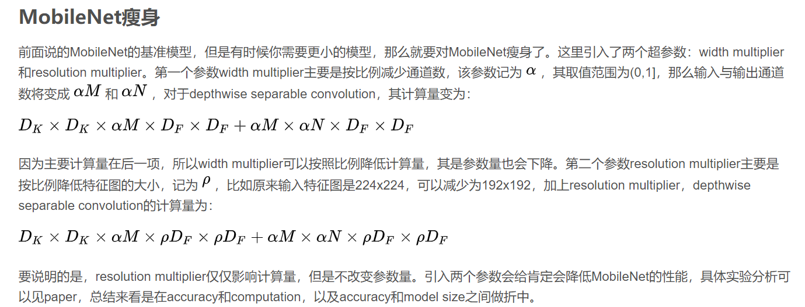

## MobileNet网络

### MobileNet V1

**Depthwise separable convolution(深度可分离卷积)**

MobileNet的基本单元是深度可分离卷积（depthwise separable convolution），其可以分解为两个更小的操作：**depthwise convolution**和**pointwise convolution**。

- depthwise convolution和标准卷积不同，对于标准卷积其卷积核是用在**所有**的输入通道上（input channels），而depthwise convolution针对**每个输入通道**采用不同的卷积核，就是说**一个卷积核对应一个输入通道**，所以说depthwise convolution是depth级别的操作。
- pointwise convolution其实就是**普通的卷积**，只不过其**采用1x1的卷积核**。

前面讲述了depthwise separable convolution，这是MobileNet的基本组件，但是在真正应用中会加入**batchnorm**，并使用ReLU激活函数，所以depthwise separable convolution的基本结构如图所示。

**MobileNetV1遗留的问题**

1. 结构问题：MobileNet V1 的结构其实非常简单，论文里是一个非常复古的直筒结构，**类似于VGG一样。**这种结构的性价比其实不高，后续一系列的 ResNet, DenseNet 等结构已经证明通过复用图像特征，使用 Concat/Eltwise+ 等操作进行融合，能极大提升网络的性价比。
2. Depthwise Convolution的潜在问题：Depthwise Conv确实是大大降低了计算量，而且N×N Depthwise +1×1PointWise的结构在性能上也能接近N×N Conv。在实际使用的时候，我们发现**Depthwise部分的kernel比较容易训废掉**：训练完之后发现Depthwise训出来的kernel有不少是空的。当时我们认为，Depthwise每个kernel dim相对于普通Conv要小得多，过小的kernel_dim, 加上ReLU的激活影响下，使得神经元输出很容易变为0，所以就学废了。ReLU对于0的输出的梯度为0，所以一旦陷入0输出，就没法恢复了。我们还发现，这个问题在定点化低精度训练的时候会进一步放大。

### MobileNet V2

**创新点**

1. 倒残差结构（Inverted Residual Block）：

   先用1x1降通道过ReLU，再3x3空间卷积过ReLU，再用1x1卷积过ReLU恢复通道，并和输入相加。之所以要1x1卷积降通道，是为了减少计算量，不然中间的3x3空间卷积计算量太大。所以Residual block是沙漏形，两边宽中间窄。

   但是，现在我们中间的3x3卷积变为了Depthwise的了，计算量很少了，所以通道可以多一点，效果更好，所以通过**1x1卷积先提升通道数，再Depthwise的3x3空间卷积，再用1x1卷积降低维度**。两端的通道数都很小，所以1x1卷积升通道或降通道计算量都并不大，而中间通道数虽然多，但是Depthwise 的卷积计算量也不大。作者称之为Inverted Residual Block，两边窄中间宽，像柳叶，较小的计算量得到较好的性能。

2. Relu6激活函数

   **MobileNet V1** 里面使用 ReLU6，ReLU6 就是普通的ReLU但是限制最大输出值为 6，这是为了在移动端设备 float16/int8 的低精度的时候，也能有很好的数值分辨率。**MobileNet V2**最后输出的 ReLU6 去掉，直接线性输出，**理由是：ReLU 变换后保留非0区域对应于一个线性变换，仅当输入低维时ReLU 能保留所有完整信息。**

